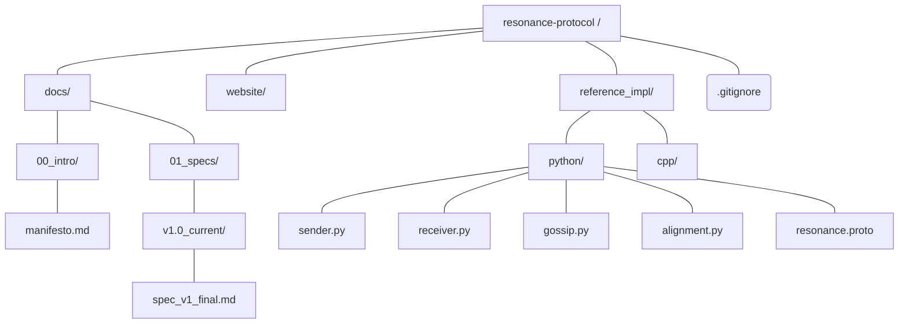

# Resonance Protocol Project Structure

This document serves as the canonical map for the Resonance Monorepo, defining the single source of truth for specifications, implementations, and documentation.

## Core Hierarchy

The repository is organized by function to support development across documentation (Docusaurus) and various programming languages (Python, C++).

## Folder Descriptions

### 1. `/docs` (Single Source of Truth)

Contains all Markdown documentation that is published via Docusaurus.

| Folder | Content | Notes | 
 | ----- | ----- | ----- | 
| `00_intro/` | High-level philosophy and project manifest. | Contains **manifesto.md** (Level 0). | 
| `01_specs/` | Technical specifications and protocol standards. |  | 
| `01_specs/v1.0_current/` | The active, implemented Level 1 standard. | Contains **spec_v1_final.md**. | 

### 2. `/website` (Web Front-end)

Contains the Docusaurus configuration and static assets for [resonanceprotocol.org].

| File/Folder | Purpose | Status | 
 | ----- | ----- | ----- | 
| `src/` | Custom pages, styles, and React components. | Essential for look & feel. | 
| `docusaurus.config.js` | Site structure, navigation, and plugins (e.g., KaTeX). |  | 
| `sidebars.js` | Defines the hierarchical menu for documentation. |  | 
| `package.json` | Project dependencies (Node/NPM). |  | 
| `build/` | **Ignored.** Generated static site output. | Stored only on the web server. | 

### 3. `/reference_impl` (Code Implementations)

Contains runnable codebases that adhere strictly to the Level 1 Specification.

| Folder | Status | Primary Language | 
 | ----- | ----- | ----- | 
| `python/` | **MVP Complete.** Includes filtering, Protobuf I/O, alignment, and gossip simulation. | Python 3 | 
| `cpp/` | *Future Work (Level 2).* Target for low-power microcontroller deployment (ESP32). | C++ | 

## Project Files (Root)

| File | Purpose | Notes | 
 | ----- | ----- | ----- | 
| `.gitignore` | **CRITICAL.** Excludes build artifacts (`node_modules/`, `website/build/`, `.docusaurus/`, Python cache). | Ensures clean Git history. | 
| `README.md` | General project overview and quick start guide. |  | 
