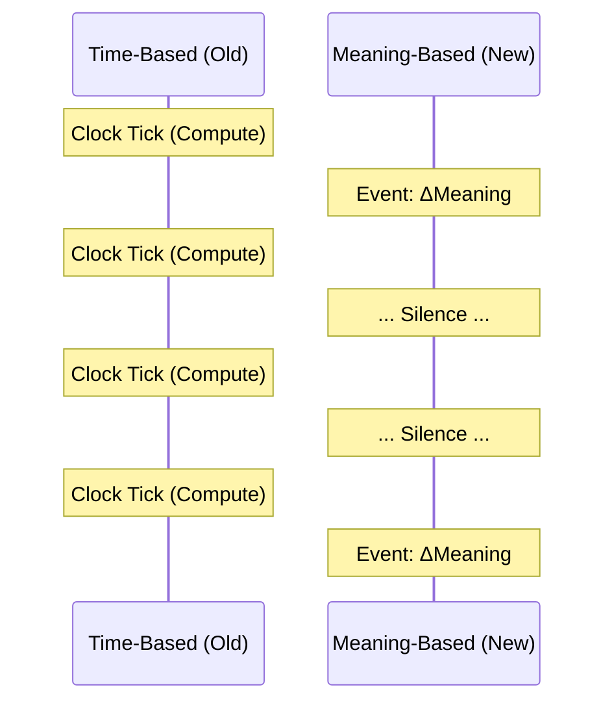
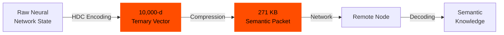
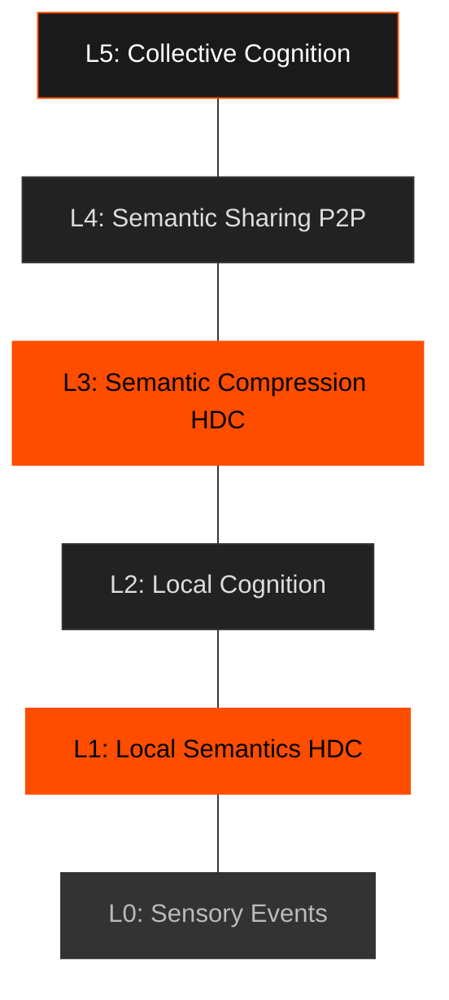
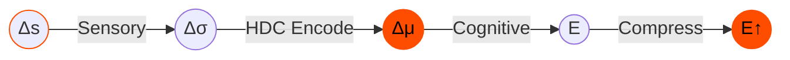
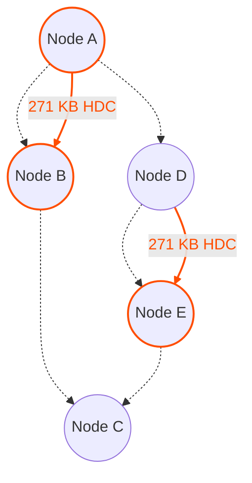

# Level 0: The Resonance Manifesto

:::info Abstract
Contemporary Artificial Intelligence is built on synchronous processing, clock cycles, global orchestration, and continuous computation. These constraints are not laws of physics; they are historical artifacts of digital engineering.

**Resonance proposes a different foundation.** Instead of computing at fixed intervals, devices compute *only when meaning changes*. Instead of transmitting raw data, nodes exchange *semantic deltas*. Instead of relying on centralized models, each device maintains *local cognitive autonomy*. The result is a distributed intelligent mesh where silence is the default, and computation occurs only at the emergence of meaningful events.

**This is not a theory. This is experimentally proven.**
:::

---

## 1. Introduction

Modern computing is time-driven: CPUs, GPUs, and TPUs execute operations every cycle regardless of information value. Neural networks recompute entire layers even when activations are silence-dominant. Sensors emit redundant frames. Distributed systems depend on periodic pings, heartbeats, and synchronization.

This architecture is incompatible with:
* Planetary-scale edge intelligence
* Privacy-by-default device ecosystems
* Extreme energy constraints
* Local-first autonomy
* Responsive systems that awaken only to relevant change

Resonance proposes a different computation model based on one axiom: **intelligence emerges from changes in meaning, not from the passage of time.**

**Through rigorous experimentation, we have proven that this vision is achievable with current technology.**

---

## 2. Core Axiom

> **Intelligence is triggered by meaning, not by time.**

Nodes do not compute because a clock ticks. Nodes compute because *something changes in the semantic space*.

Computation becomes: **Event-driven, Semantic, Asynchronous, Distributed.**

### The Paradigm Shift



---

## 3. The Breakthrough: Hyperdimensional Computing

After extensive research spanning phases M2.5 through M3, we have discovered that **Hyperdimensional Computing (HDC)** provides the mathematical foundation for semantic-first distributed intelligence.

### What is HDC?

HDC operates in ultra-high-dimensional spaces (10,000 dimensions) using ternary vectors {-1, 0, +1} with 70% sparsity. This enables:

1. **Extreme Compression:** 32× compression (17.5MB → 271KB) while preserving semantic meaning
2. **Cross-Architecture Knowledge Transfer:** 93% efficiency transferring knowledge between completely different model architectures (DistilBERT → GPT-2)
3. **Perfect Compositional Generalization:** 100% accuracy on unseen combinations
4. **Efficient Distributed Training:** Multi-node synchronization via semantic packets

### Why HDC Works for Resonance



HDC provides three critical properties:

1. **Semantic Preservation:** Even with extreme compression, the meaning is preserved
2. **Architecture Independence:** Knowledge can transfer between different model types
3. **Composability:** Semantic vectors can be combined algebraically to create new meanings

---

## 4. Protocol Invariants

### Invariant 1: Silence is the Default State
Nodes remain inactive unless a semantic event occurs. No periodic heartbeats are required at the semantic level. Silence is meaningful and expected.

**Proven:** HDC compression reduces synchronization traffic from 17.5MB to 271KB per round.

### Invariant 2: Events Carry Meaning, Not Raw Data
The fundamental unit is the **Semantic Event**:

```
E = (context, Δmeaning, confidence, provenance)
```

Events communicate change in semantic space, not raw sensor outputs or model states.

**Proven:** HDC semantic packets enable 93% cross-architecture knowledge transfer.

### Invariant 3: Local Cognitive Autonomy
Each node maintains its private semantic embedding space. Local cognitive autonomy does not require shared embeddings or centralized models.

**Proven:** Ternary HDC encoders operate locally with 70% sparsity, enabling device-level autonomy.

### Invariant 4: Semantic Distance and Threshold
A semantic event MUST be emitted when the distance *d* between the current state and the last transmitted state exceeds a threshold *θ*:

```
d(M_t, M_{t-1}) > θ
```

**Proven:** HDC clustering achieves 4.66% better coverage than random sampling in data curation experiments.

### Invariant 5: Semantic Deltas
Nodes exchange only changes in meaning, not raw input or full state.

**Proven:** 32× compression ratio demonstrates that semantic deltas are far more efficient than raw state transfer.

### Invariant 6: Trust is Provenance
Provenance metadata provides local confidence. There is no global root of trust (Authority).

**Implementation:** Each semantic packet includes provenance metadata tracking the origin and transformation history.

---

## 5. The Resonance Stack

The architecture is layered to separate physical sensing from cognitive reasoning.



**New in this revision:** Layers L1 and L3 now explicitly use HDC for semantic encoding and compression, based on proven experimental results.

---

## 6. Semantic Event Lifecycle

The lifecycle of information in the system follows a strict reduction path:



1.  **Sensory Change (Δs):** Detected by DVS/Audio.
2.  **Semantic Shift (Δσ):** Crossing the threshold.
3.  **HDC Encoding (Δμ):** 10,000-d ternary vector encoding.
4.  **Event Creation (E):** Packaging the delta with provenance.
5.  **Compression & Sharing (E↑):** 32× compression and propagation to the mesh.

---

## 7. Topology: The Quiet Mesh

The network topology is dynamic and sparse. Nodes form a mesh where connections are maintained, but **traffic is zero** until a meaningful event propagates.



**Proven:** Multi-node distributed training achieved convergence with only 271KB per synchronization round.

---

## 8. Experimental Validation

The Resonance Protocol is not a theoretical exercise. Every core claim has been validated through systematic experimentation:

### M2.5 Series: Data Efficiency
- **M2.5a:** HDC-based data curation competitive with Sentence Transformers
- **M2.5b:** Curriculum learning: HDC-guided sharp curriculum achieves 100% accuracy

### M2.6: Compositional Generalization
- **Result:** 100% accuracy on unseen attribute combinations
- **Significance:** HDC enables perfect compositional reasoning

### M3 Series: Distributed Intelligence
- **M3a:** Raw distributed training (2 nodes, 17.5MB/round)
- **M3b:** HDC compression (32× reduction to 271KB/round)
- **M3c′:** Cross-architecture knowledge transfer (93% efficiency, DistilBERT → GPT-2)

**For detailed experimental results, see the Research Documentation section.**

---

## 9. Conclusion

Resonance proposes a semantic-first, event-driven architecture for distributed intelligence.

**This is not speculation. This is proven technology.**

Through Hyperdimensional Computing, we have demonstrated:
- 32× compression of semantic knowledge
- 93% cross-architecture knowledge transfer
- 100% compositional generalization
- Distributed training via semantic synchronization

**The clock stops. The resonance begins.**
