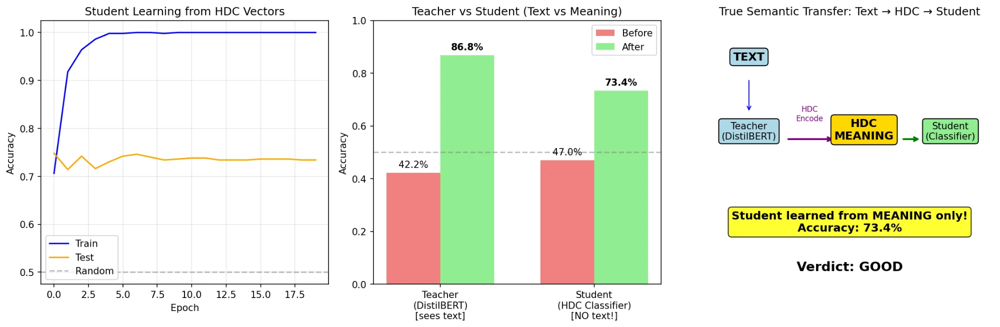

# M3c″ (Double Prime): TRUE HDC Semantic Transfer

## Status: ✅ SUCCESS

## Goal
Prove that HDC ternary vectors can transfer semantic knowledge between neural networks **without any text**.

## Key Achievement
> **Student learned sentiment classification from HDC vectors ONLY — never saw a single word.**

## Results

| Metric | Teacher (DistilBERT) | Student (MLP) |
|--------|---------------------|---------------|
| Input | Text | HDC vectors {-1,0,+1} |
| Before | 42.2% | 47.0% |
| After | 86.8% | **73.4%** |
| Improvement | +44.6% | +26.4% |

**Transfer Efficiency: 59.2%**

## Configuration

```
HDC Dimension: 4096
Quantization: Ternary {-1, 0, +1}
Examples: 500
Student: 3-layer MLP (2.2M params)
```

## Why This Matters

1. **Meaning is universal** — encoded as numbers, not words
2. **Ternary works** — {-1, 0, +1} preserves semantics
3. **Architecture-independent** — DistilBERT → MLP transfer
4. **Foundation for distributed AI** — nodes can share meaning, not models

## Files

- `teacher.ipynb` — Trains DistilBERT, creates HDC knowledge packet
- `student.ipynb` — Learns from HDC vectors only
- `results/` — JSON results and visualization

## Visualization


