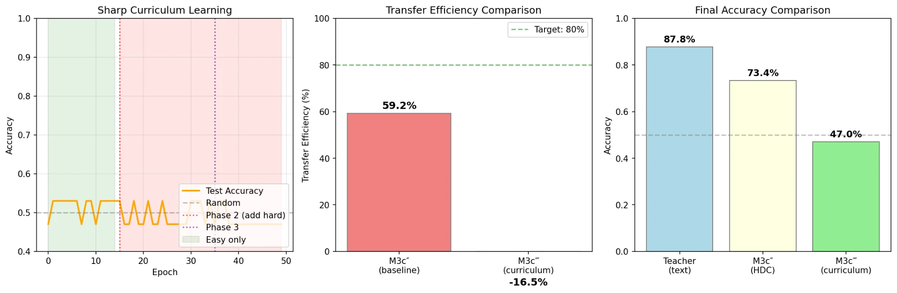

# M3c‴ v3 (Triple Prime): Curriculum-Optimized HDC Transfer

## Status: ❌ FAILED

## Goal
Improve M3c″ transfer efficiency (59% → 80%+) by applying insights from M2.5c and M2.5e experiments.

## What We Tried

| Technique | Source | Description |
|-----------|--------|-------------|
| HDC K-means curation | M2.5c | Cluster-based example selection |
| Sharp curriculum | M2.5e | Easy examples first, then hard |
| Constant LR | M2.5e | No learning rate decay |
| Difficulty scoring | M2.5e | Distance from centroid = difficulty |

## Results

| Metric | Teacher | Student |
|--------|---------|---------|
| Before | 51.4% | 53.0% |
| After | 87.8% | **47.0%** ❌ |

**Transfer Efficiency: -16.5%** (worse than random!)

## What Went Wrong

### The Graph Tells the Story

Student accuracy oscillated around 50% for all 50 epochs — **never learned anything**.

### Root Causes

1. **Curriculum learning doesn't transfer to MLP from scratch**
   - M2.5e worked on pre-trained LLM (TinyLlama)
   - MLP starts with zero knowledge, curriculum confused it

2. **Easy/Hard split ≠ Curriculum**
   - Created two different distributions
   - Not the same as sorting one dataset by difficulty

3. **Too many changes at once**
   - Changed: HDC dim, curation, curriculum, LR
   - Impossible to debug

## Key Lesson

> **Curriculum learning from M2.5e does not transfer to MLP classifiers trained from scratch.**

The success factors were:
- Pre-trained model with existing knowledge ❌ (MLP has none)
- Same dataset, different ordering ❌ (we created different datasets)
- Gradual progression ❌ (we did sharp split)

## Files

- `teacher.ipynb` — Creates curriculum-organized HDC packet
- `student.ipynb` — Attempts curriculum learning
- `results/` — JSON results and visualization
- `FAILURE_ANALYSIS.md` — Detailed breakdown

## Next Steps

Return to M3c″ baseline and try **one improvement at a time**:
1. Soft labels (teacher probabilities)
2. More examples (500 → 2000)
3. Larger HDC dimension
